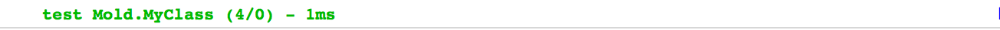
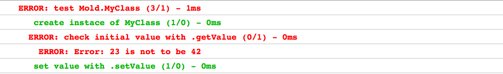
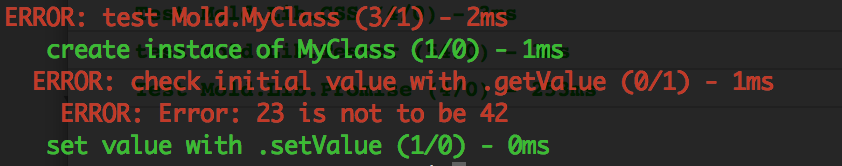

# Einleitung
MoldJS ist ein modulares MVC Webframework, das sowohl auf Server als auch auf dem Client läuft (isomorph). Integriertes Testing und ein Command Line Interface bieten eine komfortable Entwicklung.


## Installation
Mold lässt sich einfach über npm installieren. Es sollte global installiert werden um das Command Line Interface nutzen zu können.

```
	npm install -g mold-js
```

Nach dem das npm Paket installiert ist, kann mit dem Befehl 'mold' eine neues Projekt erzeugt werden. Falls das Projekt rein clientseitig entwickelt wird, muss es in einem Order angelegt werden der über http erreichbar ist.
Ein Projekt wird mit folgendem Befehl erzeugt:

 ```
 	mold project
 ```
Das Kommando startet einen Generator der die wichtigsten Projekt Informationen abfragt.  
Ist das Projekt fertig installiert kann es (so fern clientseitig) über den Browser aufgerufen werden.  
Wurde auch ein serverseitiger Teil erzeugt kann dieser mit dem Befehl:

```
	mold start
```
gestartet werden.

##Grundlegendes

### Mold Core
Der Mold Core Code ist der minimum Code geladen werden muss, er ist in einer Datei (Mold.js) zusammengefasst. 
Er bietet  Funktionalität um Mold Module (Seeds) nachzuladen, zu parsen und in andere Module zu injecten.
Ausserdem werden grundlegende Methoden der funktionalen- und der objektorientierten- Programmierung angeboten.   
Zusätzlich gibt es eine Reihe von test- und überwachungs- Methoden, die die Programmierung erleichtern, bzw. ein reaktive Programmierung möglich machen.

### Seeds
Jede MoldJS Anwendung besteht aus vielen asynchronen Modulen, ein Module wir in MoldJS Seed genannt.
Ein Seed besteht immer aus einem Header der ihn beschreibt und dem eigentlich Code.
Der Header des Seed muss die Eigenschaft 'name' enthalten, diese beschreibt sowohl den Ablageort im Dateisystem wie auch in der Objektstruktur der Anwendung.

#### DNA
Im Header jedes Seeds muss ausserdem die Eigenschaft 'dna' gesetzt werden, die DNA eines Seeds beschreibt den Code, sie definiert wie der Code ausgeführt wird, testet ob er einem bestimmten Muster entspricht, oder injiziert Abhängigkeiten.

```javascript
//File: Mold/Test.js

Seed({
		name : "Mold.Test",
		dna : "class"
	},
	function(){

	}
)
```
*Der Seed in diesem Beispiel liegt der Ordner/Datei Mold/Test.js, ist nach dem Laden als Objekt unter Mold.Test verfügbar und kann, da er die dna class hat, mit 'new' instanziert werden*


#### Dependency Management
Um Abhängigkeiten dynamisch nachzuladen und sich dabei nicht um die Synchronisation kümmern zu müssen, kann im Header die Eigenschaft 'include' gesetzt werden.
Über sie lassen sich sowohl andere Seeds als auch externe Script und Plugins nachladen. Zum Abbilden der Abhängigkeiten zwischen externen Dateien, z.B. jQuery, und jQuery Plugins, kann die include Anweisung auch verschachtelt werden. 

```javascript
//File: Mold/Test.js

Seed({
		name : "Mold.Test",
		dna : "action",
		include : [
			"Mold.Dependency"
		]
	},
	function(){
		console.log("Show after Loading Dependency")
	}
)
```


*Im Beispiel wird mit dem Ausführen des Codes gewartet bis der Seed Mold.Dependency geladen ist.*


```javascript
//File: Mold/WithjQuery.js

Seed({
		name : "Mold.WithjQuery",
		dna : "static",
		include : [
			"http://code.jquery.com/jquery-2.1.1.min.js",
			[ "https://code.jquery.com/color/jquery.color-2.1.2.min.js" ]
		]
	},
	function(){
	
		return {
			test : function(){
				return $.Color({ saturation : 0 });
			}
		}
	}
)
```
*In diesem Beispiel wird jQuery und ein Plugin von einer externen Quelle geladen, damit jQuery auch vor dem Laden des Plugins verfügbar ist, wird das include verschachtelt.*


#### Dependency Injection
Für abhängige Seeds besteht die Möglichkeit sie direkt in den Code injizieren zu lassen. Dafür muss der abhängige Seed sich in einem Objekt befinden, der Name der Eigenschaft bestimmt den Variablen Namen, der nachher innerhalb des Codes mit der gewünschten Abhängigkeit zur Verfügung steht.

```javascript
//Mold/TestWithInjection.js

Seed({
		name : "Mold.TestWithInjection",
		dna : "static",
		include : [
			{ "myClass" : "Mold.Dependency" }
		]
	},
	function(){
		
		var testInstace = new myClass();

		return testInstace.test;
	}
);
```
*Hier wird der Seed "Mold.Dependency" geladen und in die Variable myClass injiziert, danach ist er im aktuellen Seed verfügbar*

## Module

### Klassen
Eine Klasse unter Mold besteht aus einem Seed mit der DNA 'class'. Sie kann von anderen Klassen erben und ist instanzierbar.  
Die Definition einer Klasse gestaltet sich wie folgt: Die gesamte Klasse wird in einer Funktion definiert, alle Eigenschaften und Funktionen die nicht mit this. bzw. this.publics exportiert werden sind privat.  
Um von anderen Klassen zu erben kann in dem Header des Seeds die Eigenschaft 'extends' gesetzt werden. Diese muss als Inhalt den Namen des Seeds, von dem geerbt werden soll enthalten.


```javascript
//Mold/SubClass.js

Seed({
		name : "Mold.SubClass",
		dna : "class",
		extend : "Mold.SuperClass"
	},
	function(){

		this.publics = {
			subClassMethod : function(){
				console.log("subclass method called")
			}
		}
	}
);

//Mold/SuperClass.js
Seed({
		name : "Mold.SuperClass",
		dna : "class"
	},
	function(){

		this.publics = {
			superClassMethod : function(){
				console.log("superclass method called");
			}
		}

	}
);

//Mold/Main.js
Seed({
		name : "Mold.Main",
		dna : "action",
		include : [
			"Mold.SubClass"
		]
	},
	function(){	
	
		var instance = new Mold.SubClass();

		instance.superClassMethod();

		instance.subClassMethod();
	}
);

```
*In diesem Beispiel wird eine Klasse erzeugt, die von einer Superklasse erbt. Dann wird in der Main.js eine Instanz der Klasse erzeugt und eine Methode der Superklasse aufgerufen.*


### Controller
Controller können dazu eingesetzt werden den Ablauf des Programms zu steuern, zwischen Komponenten zu vermitteln und auf Ereignisse zu reagieren.
Ein Controller wird über die DNA 'controller' definiert. (Die DNA muss über den den Seed ->Mold.DNA.Controller geladen werden damit sie zur Verfügung steht, da sie nicht im Mold Core vorhanden ist.)  
Controller haben besondere Eigenschaften, so können über die Eigenschaft this.actions alle globalen und controllerspezifischen Events abgefangen werden. Ausserdem können andern Komponenten der Anwendung sich über die Methode this.register an einem Controller registrieren, so dass der Controller auch ihre Komponenten-Events abfangen kann.
Eine neue Controller Instanz kann mit new erzeugt werden.

```javascript
Seed(
	{
		name : 'Mold.TestController',
		dna : 'controller',
		include : [
			'->Mold.DNA.Controller',
			'->Mold.Lib.Template'
		]
	},
	function(){

		var view = new Mold.Lib.Templates(function(){/*|
			<a class="button" mold-event="click:@dosomething">Button</a>
		|*/})

		document.body.appendChild(view.get());

		this.register(view);

		this.actions = {
			"@dosomething" : function(){
				console.log("button clicked")
			}
		}
	}
)

```
*Dieses Beispiel erzeugt einen Templateview in einem Controller. Die View wird am Controller registriert, dadurch kann der Controller jeden klick auf den Button abfangen.*


### Routing
Um das Routing über die URL zu nutzen kann ein Seed mit der dna 'urlrouter' erzeugt werden.
Dieser erwartet im Code Teil eine JSON Objekt mit der Route als Schlüssel und der Action als Inhalt.
Als Inhalt kann eine Funktion, oder ein Event angegeben werden. Beides wird ausgeführt wenn die Route auf die URL passt.
Das Event '@ready' kann zusätzlich mit deinem Seed verknüpft werden, dieser wird beim ausführen der Route geladen.
Auf diese Weise lassen sich einfach bestimmte Bereiche einer Webseite dann dynamisch nachladen wenn sie benötigt werden.  
In einer Route können Platzhalter für bestimmte Teile einer Url vergeben werden. Mit ':' wird ein Abschnitt bis zum nächsten '/' definiert. Mit '*' der gesamte Bereiche nach dem Sternchen.Der Platzhalter wird von einem Namen gefolgt der das spätere Zugreifen auf den Inhalt ermöglicht. Die gesammelten Url Daten werden als Parameter an das rout-Event übergeben.


```javascript
Seed(
	{ 
		name : "Mold.Main",
		dna : "urlrouter",
		onhashchange : "update",
		include : [
			"->Mold.DNA.UrlRouter"
		]
	},
	{
		"/" : "@ready->Mold.MainController",
		"#login/:user/action/:postid" : "@doaction"
	}
);
```
*Zuerst definieren wir einen Seed als url Router, dann den passenden Controller dazu:*


```javascript
Seed(
	{ 
		name : "Mold.MainController",
		dna : "controller",
		include : [
			"->Mold.DNA.Controller"
		]
	},
	function(){
		this.actions = {
			"@doaction" : function(e){
				console.log("doaction", e.data.param.user, e.data.param.postid)
			}

		}
	}
);
```
*Der Controller wird sofort bei Aufruf der Url geladen und instanziert, hängen wir z.B. #login/hans/action/5 an die Url wird danach das Event "@doaction" gefeuert. Auf der Konsole wird 'doaction hans 5' ausgegeben.*

Routen können folgendermaßen spezfiziert werden:

* Beginnt eine Route mit / wird sie auf den ersten Teil der Url angewandt,
* Beginnt die Route mit ? trifft sie nur auf die Parameter einer Url zu
* Beginnt sie mit einem # auf alles was nach dem Hash kommt

Wird Mold auf Serverseite genutzt ist es zusätzliche möglich die Http Methoden der URL anzugeben.
Sie müssen groß geschrieben werden, also PUT POST GET DELETE.


### Model
Ein Mold-Model bietet die Möglichkeit ein Datenstruktur zu erstellen, zu validieren, an Templates zu binden und zwischen Server und Client auszutauschen. Über Adapter können Daten auch per LocalStorage im Browser zwischengespeichert, oder serverseitig in eine Datenbank geschrieben werden.

Ein Model in Mold kann über den Konstruktor Mold.Lib.Model, oder über eine Model DNA erzeugt werden. In diesem Beispiel wird der Model Konstruktor verwendet:

```javascript
Seed(
	{ 
		name : "Mold.MainController",
		dna : "controller",
		include : [
			"->Mold.DNA.Controller",
			"->Mold.Lib.Model",
			"->Mold.Adapter.LocalStore"
		]
	},
	function(){


		var model = new Mold.Lib.Model({
			properties : {
				list : [
					{ entry : "string" }
				]
			},
			adapter : new Mold.Adapter.LocalStore()
		});
	}
);
```
*das Konfigurationsobjekt, welches dem Konstruktor übergeben wir kann zwei Parameter enthalten die Datenstruktur (properties) und das Adapter das sich um die Persistenz kümmert.*

Ist das Model angelegt kann es über das Objekt "data" mit Daten gefüllt werden:

```javascript
model.data.list.on("list.item.add", function(e){
	console.log("Ein Element wurde zu liste hinzugefügt: ", e.data.value.entry)
})

model.data.list.push({ entry : 'mein erster Eintrag'});

``` 

*Die Liste lässt sich wie ein normales Array behandeln, allerdings lösen alle Aktionen ein Ereignis aus, so das beliebig auf das Ändern der Daten reagiert werden kann*

Wollen wir das der Inhalt der dem Model zugefügt wird validieren, können wir die Model-Validierung aktivieren:

```javascript
model.validation(true);
model.on("validation.error", function(e){
	console.log("Validierungs Fehler", e.data.name, e.data.error);
});

model.data.list.push({ entry : 5});

```
*Wird ein falscher Wert bei aktivierter Validierung gesetzt feuert das "validation.error" Ereignis*

Falls ein default Value für den Typ der Validierung vorhanden ist, wir der Wert des Models auf diesen Inhalt zurückgesetzt:

```javascript
console.log(model.data.list[1].entry)
```

*Es wird dein leerer String ausgegeben da der invalide Eintrag zurückgesetzt wird.*


Oft kann es notwendig sein das Model persistent zu speichern, deshalb kann kann bei der Initialisierung über die Eigenschaft 'adapter', ein Persistenz Adapter festgelegt werden.   
Im Frontend stehen das 'LocalStorage' und das 'Rest' Adapter zur Verfügung. Ist ein Adapter konfiguriert verfügt das Model über die Methoden 'load' und 'save'.
Als der 'save' Methode kann, der 'load' Methode muss der Parameter 'id' übergeben werden, der den Datensatz identifiziert. Wird der Methode 'save' keine Parameter übergeben wird eine eindeutige ID generiert.

```javascript
model
	.save("meine-id")
	.then(function(){
		console.log("Alle Daten wurden gespeichert!")
	})
	.fail(function(){
		console.log("Ein Fehler ist aufgetreten!")
	})
```
*Speichert das model unter 'meine-id' ab. Im Beispiel ist LocalStorage als Adapter konfiguriert, die Daten werden also im Browser gespeichert. Wäre das Rest Adapter eingerichtet, würde ein POST Request an den Service gesendet*

```javascript
model
	.load("meine-id")
	.then(function(){
		console.log("Das Model wurde geladen!")
	})
```
*Lädt das Model wieder anhand der id.*

(Zum Modelverhalten im Backend wird es später noch einen Artikel geben.)

### Templates
Mold enthält eine eigene kleine Templateengine, im Gegensatz zu vielen andern ist sie nicht String sondern DOM basiert. Dass heißt es werden Pointer auf Dom-Elemente gespeichert, über welche nachher auf die Elemente zugegriffen werden kann. 
Templates können wie Models über eine Eigene DNA oder einen Konstruktor erzeugt werden. Dem Konstruktor des Template kann entweder eine String eine Url, oder eine Multiline Funktion mitgegeben werden. Die Template Syntax ist frei von Logik und orientiert sich an der Syntax von "Mustache.js". Details dazu gibt es in der Funktionsreferenz.  
Hier ein kleines Beispiel Konstruktor und Multiline Funktion:
	
```javascript
Seed(
	{ 
		name : "Mold.TestTemplate",
		dna : "action",
		include : [
			"->Mold.Lib.Template"
		]
	},
	function(){
		var template = new Mold.Lib.Template(function(){
			/*|
				{{#list}}
				<div>
					{{myproperty}}
				</div>
				{{/list}}
			|*/
		});
		
		document.body.appendChild(template.get());
	}
);
```

*Es wird ein Template aus einer Multiline Funktion erzeugt.*

Um den erstellten Baum des Templates anzeigen zu lassen bzw. zu manipulieren kann die Methode 'tree' genutzt werden. Das Manipulieren der Daten über die Template Nodes ist allerdings relative umständlich weshalb vereinfachte Methoden zur Verfügung stehen.
Über '.append' kann z.B. einfach ein Datenobjekt an das Template übergeben werden.

```javascript
template.append({
	list : [
		{ myproperty : "One"},
		{ myproperty : "Two"},
		{ myproperty : "Three"}
	]
});
	
```

In diesem Beispiel werden drei Elemente in die Liste 'list' eingefügt. Das erzeugte HTML sieht danach so aus:


```javascript
	<div>
		One
	</div>
	<div>
		Two
	</div>
	<div>
		Three
	</div>

```

Effektiv arbeiten Templates insbesondere mit Models zusammen, dazu gibt es die Methode '.bind' die ein Model an ein Template bindend, dazu später mehr.


###Komponenten
Komponenten werden im Mold über die DNA 'component' erzeugt. Mit ihnen können neue Domelemente erzeugt und vorhandene manipuliert werden, um sie zu erzeugen gibt es in Mold ähnlich wie in Angular Direktiven.  
Eine Komponente kann z.B. wie folgt aussehen:

```javascript
Seed({
		name : "Mold.Test",
		dna : "component",
		include : [
			"->Mold.DNA.Component",
			{ Element : "->Mold.Lib.Element" }
		],
		files : [
			"1.jpg",
			"2.jpg"
		],
		directives : [
			{
				at : "element",
				name : "x-imagelist",
				watchable : true,
				collect : {
					attribute : [
						"show"
					]
				} 
			}
		],
		register : 'all'
	},
	function(node, element, collection, component){

		element.val("loading");

		var image = new Element("img");

		element.addMethod('setImage', function(path){
			image.src = path;
			element.append(image);
		})

		this.actions = {

			"@files.loaded" : function(){
				element.val('');
				element.setImage(component.files()[collection.show || 0]);
			},

			"@show.changed" : function(){
				element.setImage(component.files()[collection.show])
			}
		}
	}
)
	
```
*Diese Beispiel Komponente wird erzeugt sobald ein Element Namens x-imagelist einem Dokument enthalten ist, oder per document.createElement erzeugt wird.*

Im Detail setzt sich die Komponente wie folgt zusammen:  

* Sie hat die DNA **'component'** die über den externen Seed Mold.DNA.Component geladen wird. 
* Im header werden über die Eigenschaft **'files'** zwei Bilder angegeben die beim Erstellen der Komponente geladen werden.
* Die Eigenschaft **'directives'** enthält Direktiven die beschreiben auf welche Elemente die Componente angewandt wird. Eine Direktive enthält zum eine die Beschreibung des Elementes auf das sie angewandt werden soll (Im obigen Fall also Elemente mit dem Namen **x-imagelist**), zum anderen kann über das collect Objekt angegeben werden welches Informationen über ein Element gesammelt werden sollen. Bei diesem Beispiel das Attribute **'show'**.   
Die Eigenschaft **'watchable'** legt fest ob die collection überwacht werden soll. Das heißt falls sich z.B. ein Element Attribute ändert ein Ereignis feuert. 
* Über die Eigenschaft **register : 'all'** kann festgelegt werden das ob die Collection und die Komponente am Komponenten-Controller automatisch registriert werden.

Nach dem Headeraufbau folgt der der Komponenten-Controller. Er ist eine normal Controller Instanz die für jedes Element in der Directive erzeugt wird. Ihm werden 4 Parameter übergeben, **'node'** die DOM-Node (Element-/ Attributnode) auf die die Directive zutrifft, **'element'** das DOM Element (eine Instanz von Mold.Lib.Element), **'collection'** ein Objekt mit den gesammelten Daten und **'componente'** die Instanz der Komponente mit Methoden und Events um z.B. zu ladende Dateien zu handeln.

Da der Komponenten-Controller eine Instanz von Mold.Lib.Controller ist und über register : 'all' collection und component registriert wurden, können in this.action ihre Ereignisse abgefangen werden.


##Alles zusammen (Beispiel ToDo MVC)
Um zu verstehen wie alles zusammen arbeitet, hier eine kleine Beispiel Applikation:

```javascript
//Filename Mold/Todo.js
Seed(
	{ 
		name : "Mold.Todo",
		dna : "component",
		include : [
			"->Mold.DNA.Component",
			"->Mold.Lib.Template",
			"->Mold.Lib.Model",
			"->Mold.Lib.Color",
			"->Mold.Adapter.LocalStore"
		],
		directives : [
			{
				at : "element",
				name : "x-todo"
			}
		]
	},
	function(node, element, collection, component){

		// Template erzeugen
		var template = new Mold.Lib.Template(function(){
			/*|
				<ul class="todo-list">
					{{#list}}
						<li style="color:{{color}};">
							{{+}}. {{entry}}
							<a href="#" mold-event="click:@delete.entry" index="{{+}}">
								delete
							</a>
						</li>
					{{/list}}
				</ul>
				<input name="entry" value="" type="text" mold-data="listdata">
				{{#error}}
					<p class="error">{{.}}</p>
				{{/error}}
				<br>
				<div class="actions">
					<a href="#" mold-event="click:@add.entry">add</a>
					<a href="#" mold-event="click:@delete.all">delete all</a>
				</div>
			|*/
		});

		// ein Model für die Daten erstellen
		var model = new Mold.Lib.Model({
			properties : {
				list : [
					{ 
						entry : "string",
						color : "string"
					}
				]
			},
			adapter : new Mold.Adapter.LocalStore()
		});
	
		// und noch eins für Fehlermeldungen
		var error = new Mold.Lib.Model({
			properties : {
				error : "string"
			}
		})

		// beide Models an das Template binden
		template.bind(model);
		template.bind(error);
		
		// eventuel vorhandene Daten laden
		model.load("my-todo");

		// das Template am Controller registrieren 
		// damit die Events im Controller abgefangen werden können
		this.register(template);

		// das Template an das Direktivenelement hängen
		element.append(template.get());

		// auf die Ereignisse reagieren
		this.actions = {
			"@add.entry" : function(e){
				
				// die Directive mold-data liest die Daten aus dem Textfeld aus 
				// und fügt sie den Eventdaten hinzu, falls nichts eigegeben wurde
				// wird das error model gesetzt
				
				if(e.data.listdata && e.data.listdata.entry !== ""){
					model.data.list.push({ 
						entry : e.data.listdata.entry,
						color : Mold.Lib.Color.randomColor()
					})
					
					error.data.error = false;
					
					//Wenn Daten hinzugefügt wurden wird das Model gespeichert
					model.save();
					
				}else{
					error.data.error = "The field is empty!"
				}
			},
			"@delete.entry" : function(e){
				
				// Wird das löschen Ereignis ausgelöst kann mit der Methode .splice 
				// einfach das Element aus der Liste gelöscht werden.
				model.data.list.splice(e.data.element.getAttribute('index'), 1);
				model.save();
			},
			"@delete.all" : function(e){
				
				// soll alles gelöscht werden kann einfach 
				// die Methode .remove aufgerufen werden 
				model.data.list.remove();
				model.save();
			}	
		}
	}
);

```
Um die Applikation in eine Webseite einzubinden genügt es das Element x-todo ins Markup zu integrieren. 
Handelt es sich um größere Komponenten sollten sowohl Template als auch Model in extra Dateien ausgelagert werden.


##Testing
Mold hat ein integriertes BDD Testtool mit einer an [Jasmin](http://jasmine.github.io/) angelehten Syntax. Tests werden, wie alles in Mold, in einem Seed  abgelegt (natürlich mit der DNA 'test'). Sie werden direkt an den zu testenden Seed gebunden.

###clientseitig testen
Zu erst ein Beispiel für das clientseitig Testing.
In einem Projekt soll die Klasse "MyClass" getestet werden:

```javascript
//file Mold/MyClass.js
Seed({
		name : "Mold.MyClass",
		dna : "class",
		test : "Mold.MyTest"
	},
	function(){
		var _myValue = 42;

		this.publics = {
			getValue : function(){
				return _myValue;
			},
			setValue : function(value){
				_myValue = value;
			}

		}
	}
);
```

Der Klasse wird im Header, über die Eigenschaft 'test', ein Testseed zugewiesen, dieser sieht z.B. so aus:

```javascript
//file Mold/MyTest.js
Seed({
		name : "Mold.MyTest",
		dna : "test"
	},
	function(MyClass){

		describe("test Mold.MyClass", function(){
			var instance;

			it("create instance of MyClass", function(){
				instance =  new MyClass();
				expect(instance).toBeInstanceOf(MyClass);
			})

			it("check initial value with .getValue", function(){
				expect(instance.getValue()).toBe(42);
				expect(instance.getValue()).not.toBe(23)
			})

			it("set value with .setValue", function(){
				instance.setValue(23);
				expect(instance.getValue()).toBe(23);
				expect(instance.getValue()).not.toBe(43);
			})
		});

	}
);
```

Wichtig ist die dna 'test'. Um im (clientseitigen) Projekt alle Seeds mit Tests, automatisch testen zu lassen muss in der Projekt Start Datei der Seed "Mold.Tools.Test.AutoTest" geladen werden. Wichtig ist dabei das alle folgenden Klassen danach geladen werden, weshalb eine verschachtelte Include Anweisung notwendig ist:

```javascript
//file: Mold/Main.js
Seed({
		name : "Mold.Main",
		dna : "action",
		include : [
			"->Mold.Tools.Test.AutoTest",
			[ "Mold.MyClass" ]
		]
	},
	function(){
		
	}
);

```

Ist alles wie oben eingerichtet bekommen wir im auf der Konsole im Browser  folgends angezeigt:



Ändern wir in der Klasse jetzt den Initialwert von _myValue:

```javascript
	_myValue = 23;
```

bekommen wir folgende Fehlermeldung:



Das Modul Mold.Tools.Test.AutoTest sollte vor dem Deployment entfernt werden um auf dem Produktivesystem das Laden und ausführen der Tests zu verhinden.


###serverseitiges Testen
Das serverseitig Testing ist noch einfacher zu händeln als das Testen im Browser. Es wird keine extra Tool dazu benötigt sondern nur eine gültige Mold Projekt Datei (mold.project.json). Ist diese angelegt brauchen wir auf der Konsole nur in das Rootverzeichnis unseres Projektes wechseln und folgendes Kommando ausführen:

```
mold test
```
Im Erfolgsfall erhalten wird dann folgende Meldung:


Im Fehlerfall sieht sie so aus:



Zu beachten ist das auf serverseite kein DOM existiert und deshalb alle Test die darauf angewiesen sind fehlschlagen werden, deshalb sollte bei Seeds die nicht serverseitig lauffähig sind im header die Eigenschaft **platform : 'browser'**, gesetzt werden. Dies sorgt dafür das serverseitige Tests sie ignorieren. 
Andersrum, sollten Seeds nur unter node laufen ein **platform : 'node'** erhalten, um nicht clientseitig geladen zu werden.


 


